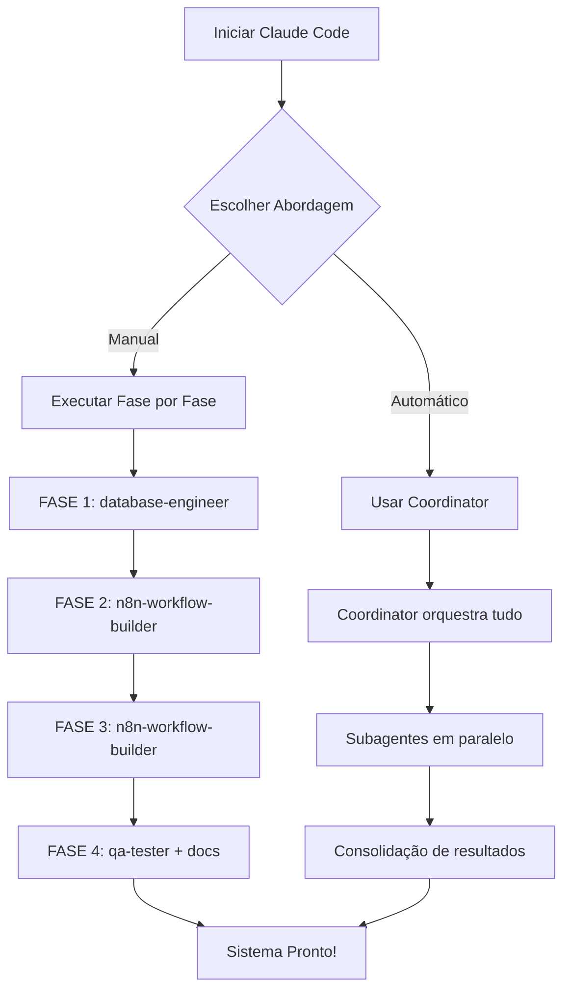

# Como Executar o Projeto Self-Improving com Equipe de Agentes Claude

## Estrutura de Agentes Criada

```
.claude/
├── settings.json           # Configurações gerais
└── agents/
    ├── coordinator.md      # Orquestrador principal (Opus)
    ├── database-engineer.md    # SQL/Supabase (Sonnet)
    ├── n8n-workflow-builder.md # Workflows n8n (Sonnet)
    ├── python-developer.md     # Scripts Python (Sonnet)
    ├── qa-tester.md            # Testes (Sonnet)
    └── documentation-writer.md # Documentação (Haiku)
```

## Como Usar no Terminal

### Opção 1: Execução Direta com Tarefas Paralelas

Abra o terminal na pasta do projeto e execute:

```bash
cd "/Users/marcosdaniels/Documents/Projetos/MOTTIVME SALES TOTAL/projects/n8n-workspace/Fluxos n8n/AI-Factory- Mottivme Sales"

# Iniciar Claude Code
claude

# Comandos para executar com múltiplos agentes:
```

### Opção 2: Comandos Específicos por Fase

#### FASE 1: Fundação (Banco de Dados)
```
Use o database-engineer agent para:
1. Revisar a migration 001_self_improving_system.sql
2. Gerar script de verificação pós-execução
3. Criar queries de teste
```

#### FASE 2: Reflection Loop
```
Use o n8n-workflow-builder agent para criar o workflow 11-Reflection-Loop.json que:
1. Roda a cada 6 horas
2. Busca conversas recentes do Supabase
3. Avalia com Claude usando rubrica de 5 critérios
4. Decide ação baseado nos thresholds
5. Salva em reflection_logs
```

#### FASE 3: Prompt Improver
```
Use o n8n-workflow-builder agent para criar o workflow 12-Prompt-Improver.json que:
1. É triggado quando reflection_log.action_taken != 'none'
2. Busca prompt atual + fraquezas identificadas
3. Gera novo prompt melhorado com Claude
4. Cria improvement_suggestion no Supabase
```

#### FASE 4: Integração e Testes
```
Execute em paralelo:
- Use o n8n-workflow-builder para atualizar 07-Engenheiro-de-Prompt
- Use o qa-tester para validar todos os workflows
- Use o documentation-writer para documentar o sistema
```

### Opção 3: Execução Completa Orquestrada

```
Use o coordinator agent para implementar o sistema completo de self-improving AI.
Execute as 4 fases em ordem, usando os subagentes apropriados em paralelo quando possível.
Retorne um relatório de progresso ao final de cada fase.
```

## Comandos Úteis

### Listar Agentes Disponíveis
```
/agents
```

### Ver Status de um Agente
```
Mostre o status do agente database-engineer
```

### Executar Múltiplos Agentes em Paralelo
```
Execute em paralelo:
1. Use database-engineer para revisar a migration SQL
2. Use documentation-writer para criar README do self-improving
3. Use python-developer para criar script de health check
```

### Resumir Trabalho de Agente Anterior
```
Resume o agente [agent-id] e continue de onde parou
```

## Fluxo Recomendado



## Monitoramento de Progresso

Durante a execução, você verá mensagens como:

```
[coordinator] Iniciando FASE 1: Fundação
  [database-engineer] Revisando migration SQL...
  [documentation-writer] Criando documentação inicial...
[coordinator] FASE 1 concluída. Iniciando FASE 2...
  [n8n-workflow-builder] Criando 11-Reflection-Loop.json...
```

## Troubleshooting

### Se um agente falhar:
```
Resume o agente [id] e corrija o erro: [descrição do erro]
```

### Se precisar mudar de estratégia:
```
Pause a execução atual e use o qa-tester para validar o que já foi feito
```

### Se quiser ver detalhes:
```
Mostre logs detalhados do último agente executado
```

## Próximo Passo

Execute este comando para começar:

```bash
cd "/Users/marcosdaniels/Documents/Projetos/MOTTIVME SALES TOTAL/projects/n8n-workspace/Fluxos n8n/AI-Factory- Mottivme Sales"
claude
```

E então digite:

```
Use o coordinator agent para implementar o sistema de self-improving AI, começando pela FASE 1 (fundação do banco de dados).
```
