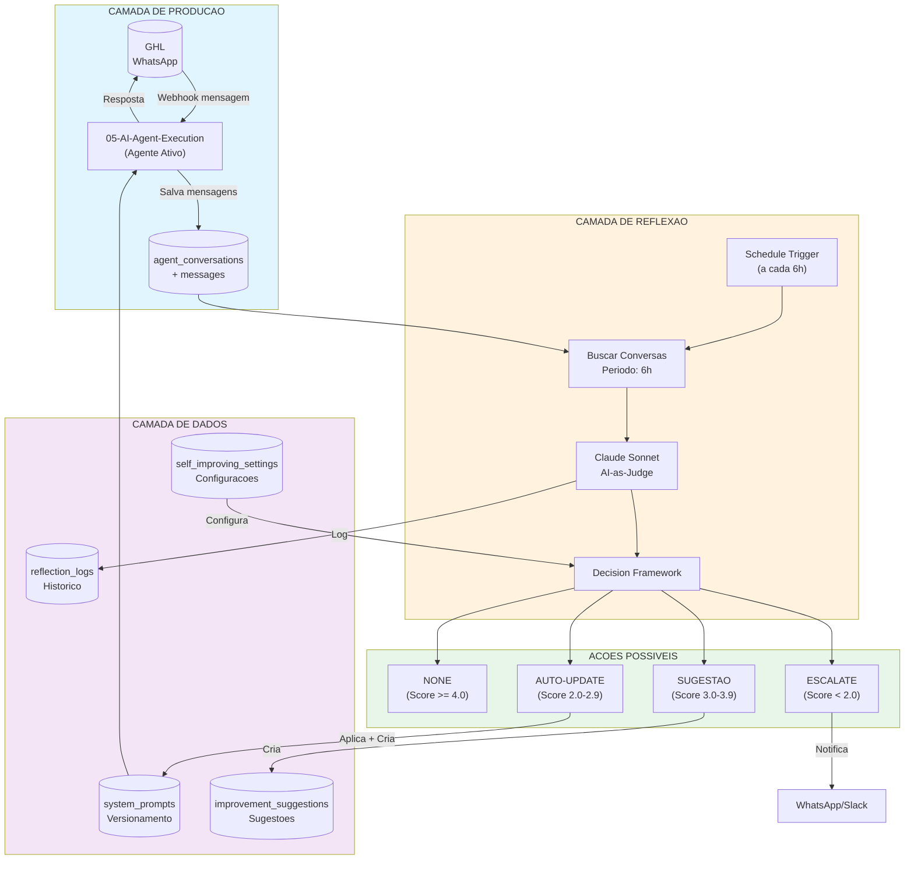
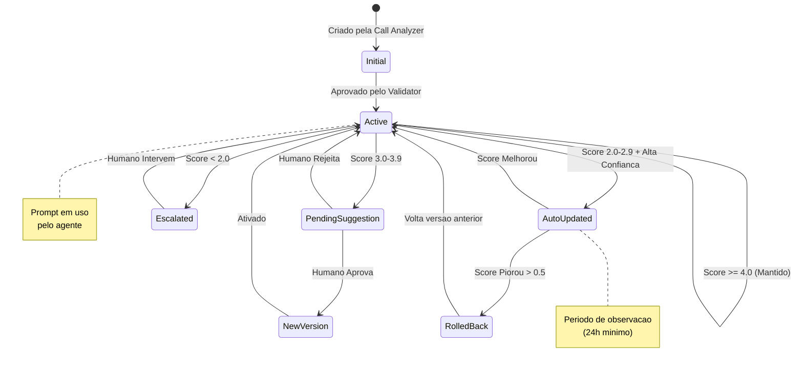
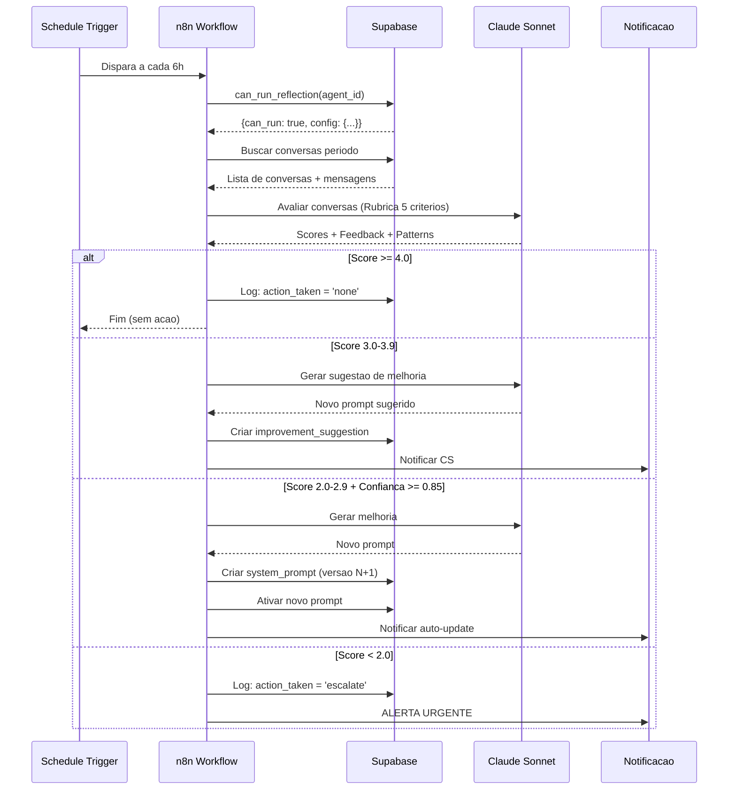
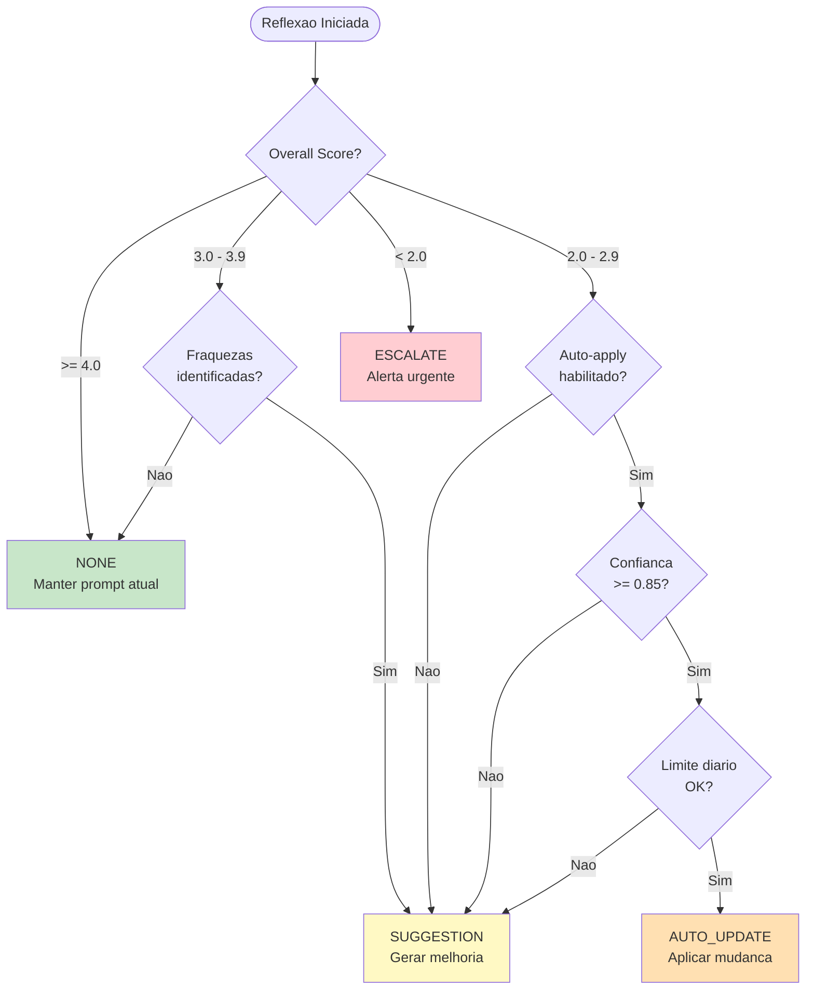

# Self-Improving AI System

**Sistema de Auto-Melhoria de Agentes de IA**
**Versao:** v1.0
**Ultima Atualizacao:** 2025-12-27
**Baseado em:** Self_Improving_System_Starter_Kit + AI Factory V4

---

## Indice

1. [Visao Geral do Sistema](#1-visao-geral-do-sistema)
2. [Arquitetura](#2-arquitetura)
3. [Componentes Principais](#3-componentes-principais)
4. [Fluxo de Funcionamento](#4-fluxo-de-funcionamento)
5. [Configuracoes Disponiveis](#5-configuracoes-disponiveis)
6. [Decision Framework](#6-decision-framework)
7. [Rubrica de Avaliacao](#7-rubrica-de-avaliacao)
8. [Integracao com n8n](#8-integracao-com-n8n)
9. [Seguranca e Guardrails](#9-seguranca-e-guardrails)
10. [Troubleshooting](#10-troubleshooting)

---

## 1. Visao Geral do Sistema

O **Self-Improving AI System** e um sistema autonomo de auto-melhoria para agentes de IA conversacionais. Ele utiliza a tecnica **LLM-as-Judge** (IA avaliando IA) para:

- **Monitorar** a performance de agentes em producao
- **Avaliar** conversas usando uma rubrica de 5 criterios
- **Gerar sugestoes** de melhoria de prompts automaticamente
- **Aplicar mudancas** de forma segura com rollback automatico
- **Versionar** prompts com historico completo

### Problema que Resolve

| Antes | Depois |
|-------|--------|
| Testes manuais demorados | Avaliacao automatica continua |
| Impossivel saber se agente esta bom | Scores objetivos de 0-5 em 5 dimensoes |
| Sem escalabilidade | Processa centenas de conversas/dia |
| Melhorias dependem de humano | Auto-melhoria com supervisao |

### Conceito Central: Reflection Loop

O sistema implementa um **ciclo de reflexao** onde:

1. Agente executa conversas normalmente
2. Periodicamente, um **Evaluator LLM** (Claude Sonnet) analisa as conversas
3. Baseado nos scores, o sistema decide se deve:
   - Fazer nada (score alto)
   - Gerar sugestao de melhoria
   - Aplicar melhoria automaticamente
   - Escalar para humano (score muito baixo)

---

## 2. Arquitetura

### Diagrama de Arquitetura Completa



### Diagrama do Ciclo de Vida do Prompt



### Diagrama de Sequencia: Ciclo de Reflexao



---

## 3. Componentes Principais

### 3.1 Tabelas do Banco de Dados

O sistema utiliza 4 tabelas principais no Supabase:

#### system_prompts - Versionamento de Prompts

Armazena todas as versoes de prompts com historico completo.

| Campo | Tipo | Descricao |
|-------|------|-----------|
| id | UUID | Identificador unico |
| agent_version_id | UUID | FK para agent_versions |
| version | INTEGER | Numero da versao (1, 2, 3...) |
| parent_id | UUID | Referencia ao prompt anterior |
| is_active | BOOLEAN | Se e o prompt ativo |
| prompt_content | TEXT | Conteudo do prompt |
| model_config | JSONB | Configuracoes do modelo (temperature, tools) |
| performance_score | DECIMAL(3,2) | Score medio (0.00-5.00) |
| change_reason | TEXT | Trigger: auto_improvement, manual_edit, rollback |
| activated_at | TIMESTAMPTZ | Quando foi ativado |

**Indices importantes:**
- idx_system_prompts_active: Busca rapida do prompt ativo
- idx_system_prompts_performance: Ordenacao por performance

#### reflection_logs - Logs de Reflexao

Registra cada ciclo de avaliacao executado.

| Campo | Tipo | Descricao |
|-------|------|-----------|
| id | UUID | Identificador unico |
| agent_version_id | UUID | Agente avaliado |
| period_start | TIMESTAMPTZ | Inicio do periodo analisado |
| period_end | TIMESTAMPTZ | Fim do periodo |
| conversations_analyzed | INTEGER | Quantidade de conversas |
| score_completeness | DECIMAL(3,2) | Completude (peso 20%) |
| score_depth | DECIMAL(3,2) | Profundidade (peso 25%) |
| score_tone | DECIMAL(3,2) | Tom/Personalidade (peso 15%) |
| score_scope | DECIMAL(3,2) | Escopo/Relevancia (peso 20%) |
| score_missed_opportunities | DECIMAL(3,2) | Oportunidades Perdidas (peso 20%) |
| overall_score | DECIMAL(3,2) | Score agregado (media ponderada) |
| strengths | TEXT[] | Pontos fortes identificados |
| weaknesses | TEXT[] | Pontos fracos identificados |
| patterns_identified | TEXT[] | Padroes detectados |
| action_taken | VARCHAR(50) | Decisao: none, suggestion, auto_update, escalate |
| cooldown_respected | BOOLEAN | Se respeitou periodo minimo |

#### improvement_suggestions - Sugestoes de Melhoria

Armazena sugestoes geradas pelo sistema, pendentes de aprovacao.

| Campo | Tipo | Descricao |
|-------|------|-----------|
| id | UUID | Identificador unico |
| agent_version_id | UUID | Agente alvo |
| reflection_log_id | UUID | Reflexao que gerou |
| suggestion_type | VARCHAR(50) | prompt_update, config_change, escalation |
| current_value | TEXT | Prompt atual |
| suggested_value | TEXT | Prompt sugerido |
| diff_summary | TEXT | Resumo das diferencas |
| rationale | TEXT | Justificativa da IA |
| confidence_score | DECIMAL(3,2) | Confianca (0.00-1.00) |
| focus_areas | TEXT[] | Areas de foco: tone, completeness, etc |
| status | VARCHAR(50) | pending, approved, rejected, auto_applied, rolled_back |
| post_apply_score | DECIMAL(3,2) | Score apos aplicar |
| improvement_delta | DECIMAL(3,2) | Diferenca de score |

#### self_improving_settings - Configuracoes

Configuracoes do sistema por agente.

| Campo | Tipo | Default | Descricao |
|-------|------|---------|-----------|
| reflection_enabled | BOOLEAN | true | Sistema ativo |
| reflection_interval_hours | INTEGER | 6 | Horas entre reflexoes |
| min_conversations_for_reflection | INTEGER | 10 | Minimo de conversas |
| threshold_none | DECIMAL | 4.0 | Score para nenhuma acao |
| threshold_suggestion | DECIMAL | 3.0 | Score para sugestao |
| threshold_auto_update | DECIMAL | 2.0 | Score para auto-update |
| max_updates_per_day | INTEGER | 3 | Limite de updates/dia |
| auto_apply_enabled | BOOLEAN | false | Permite auto-update |
| auto_apply_min_confidence | DECIMAL | 0.85 | Confianca minima |
| auto_apply_max_score_drop | DECIMAL | 0.5 | Rollback se cair mais |
| evaluator_model | VARCHAR | claude-sonnet-4-20250514 | Modelo avaliador |

### 3.2 Views para Dashboard

#### vw_self_improving_summary

Resumo de status do sistema por agente.

```sql
SELECT * FROM vw_self_improving_summary;
```

Retorna:
- Prompt ativo e versao
- Score atual
- Ultima reflexao e acao tomada
- Sugestoes pendentes
- Contadores das ultimas 24h

#### vw_score_evolution

Evolucao de scores ao longo do tempo.

```sql
SELECT * FROM vw_score_evolution WHERE agent_version_id = 'uuid';
```

Retorna:
- Score medio por dia
- Breakdown por criterio
- Quantidade de auto-updates e escalacoes

#### vw_pending_suggestions

Sugestoes aguardando aprovacao.

```sql
SELECT * FROM vw_pending_suggestions ORDER BY confidence_score DESC;
```

### 3.3 RPC Functions

#### get_self_improving_config(agent_id)

Retorna configuracoes do agente com valores padrao se nao existir.

```sql
SELECT get_self_improving_config('agent-uuid-here');
```

#### can_run_reflection(agent_id)

Verifica se pode executar reflexao (cooldown, limites).

```sql
SELECT can_run_reflection('agent-uuid-here');
```

Retorna:
```json
{
  "can_run": true,
  "reason": "OK",
  "hours_since_last": 7.5,
  "updates_today": 1,
  "config": {...}
}
```

---

## 4. Fluxo de Funcionamento

### 4.1 Fluxo Completo Passo a Passo

```
PASSO 1: COLETA DE DADOS
========================
- Agente executa conversas normalmente (05-AI-Agent-Execution)
- Cada mensagem e salva em agent_conversations + messages
- Sistema aguarda periodo minimo (6h default)

PASSO 2: TRIGGER DE REFLEXAO
============================
- Schedule trigger dispara (a cada 6h)
- Verifica: can_run_reflection(agent_id)
  - Cooldown respeitado?
  - Limite diario OK?
  - Minimo de conversas?

PASSO 3: COLETA DE CONVERSAS
============================
- Busca conversas do periodo (period_start, period_end)
- Filtra apenas conversas finalizadas
- Formata para analise

PASSO 4: AVALIACAO (LLM-as-Judge)
=================================
- Envia conversas para Claude Sonnet
- Prompt de avaliacao com rubrica de 5 criterios
- Recebe: scores, feedback, patterns, strengths, weaknesses

PASSO 5: DECISION FRAMEWORK
===========================
- Calcula overall_score (media ponderada)
- Aplica thresholds:
  - >= 4.0: NONE
  - 3.0-3.9: SUGGESTION
  - 2.0-2.9: AUTO_UPDATE (se enabled e confianca alta)
  - < 2.0: ESCALATE

PASSO 6: EXECUCAO DA ACAO
=========================
[Se NONE]
- Apenas loga a reflexao
- Nenhuma mudanca

[Se SUGGESTION]
- Gera novo prompt sugerido via LLM
- Cria improvement_suggestion com status 'pending'
- Notifica CS para revisao

[Se AUTO_UPDATE]
- Gera novo prompt via LLM
- Cria system_prompt versao N+1
- Ativa novo prompt
- Inicia periodo de observacao (24h)
- Notifica sobre mudanca

[Se ESCALATE]
- Loga como critico
- Envia alerta urgente
- Bloqueia auto-updates temporariamente

PASSO 7: MONITORAMENTO POS-ACAO
===============================
[Para AUTO_UPDATE]
- Apos 24h, avalia novo score
- Se piorou > max_score_drop: ROLLBACK
- Se melhorou: confirma mudanca
```

### 4.2 Exemplo Pratico

```
Cenario: Agente Isabella SDR com score caindo

Dia 1, 18:00 - Reflexao #1
- Conversas: 25
- Score: 4.2 (EXCELENTE)
- Acao: NONE
- Status: Tudo OK

Dia 2, 00:00 - Reflexao #2
- Conversas: 18
- Score: 3.7 (BOM)
- Acao: SUGGESTION
- Criado: improvement_suggestion com foco em 'tone'
- Notificado: CS recebe mensagem WhatsApp

Dia 2, 10:00 - CS aprova sugestao
- Status: approved
- Novo prompt v2 criado e ativado

Dia 2, 12:00 - Reflexao #3
- Conversas: 15
- Score: 4.1 (EXCELENTE)
- Acao: NONE
- Delta: +0.4 (melhoria confirmada!)
```

---

## 5. Configuracoes Disponiveis

### 5.1 Configuracoes de Reflexao

| Configuracao | Default | Recomendado | Descricao |
|--------------|---------|-------------|-----------|
| reflection_enabled | true | true | Habilita o sistema |
| reflection_interval_hours | 6 | 6-12 | Intervalo entre reflexoes |
| min_conversations_for_reflection | 10 | 10-20 | Minimo para amostra valida |

### 5.2 Thresholds de Decisao

| Threshold | Default | Ajuste | Descricao |
|-----------|---------|--------|-----------|
| threshold_none | 4.0 | 3.8-4.2 | Score para "tudo OK" |
| threshold_suggestion | 3.0 | 2.8-3.2 | Score para gerar sugestao |
| threshold_auto_update | 2.0 | 2.0-2.5 | Score para auto-update |

**Abaixo de threshold_auto_update = ESCALATE**

### 5.3 Limites de Seguranca

| Limite | Default | Descricao |
|--------|---------|-----------|
| max_updates_per_day | 3 | Maximo de auto-updates por dia |
| cooldown_after_update_hours | 6 | Periodo de observacao apos mudanca |
| require_approval_below_confidence | 0.8 | Abaixo disso, requer aprovacao humana |

### 5.4 Configuracoes de Auto-Apply

| Configuracao | Default | CUIDADO |
|--------------|---------|---------|
| auto_apply_enabled | **false** | Habilitar permite mudancas automaticas! |
| auto_apply_min_confidence | 0.85 | Minimo 85% de confianca da IA |
| auto_apply_max_score_drop | 0.5 | Rollback se score cair mais que 0.5 |

### 5.5 Modelo Avaliador

| Modelo | Custo | Qualidade | Recomendado |
|--------|-------|-----------|-------------|
| claude-sonnet-4-20250514 | Medio | Alta | **Default** |
| claude-opus-4-20250514 | Alto | Muito Alta | Casos criticos |
| gpt-4o | Medio | Alta | Alternativa |

---

## 6. Decision Framework

### 6.1 Arvore de Decisao Detalhada



### 6.2 Tabela de Decisao

| Score | Condicao Extra | Acao | Notificacao |
|-------|----------------|------|-------------|
| >= 4.0 | - | NONE | Nenhuma |
| 3.5 - 3.9 | Fraquezas menores | SUGGESTION | Email/Slack opcional |
| 3.0 - 3.4 | Fraquezas claras | SUGGESTION | WhatsApp CS |
| 2.5 - 2.9 | Auto-apply OFF | SUGGESTION | WhatsApp CS |
| 2.5 - 2.9 | Auto-apply ON + Conf >= 0.85 | AUTO_UPDATE | WhatsApp notificacao |
| 2.0 - 2.4 | Auto-apply ON + Conf >= 0.85 | AUTO_UPDATE | WhatsApp + Slack |
| < 2.0 | - | ESCALATE | WhatsApp URGENTE + Slack |

---

## 7. Rubrica de Avaliacao

### 7.1 Os 5 Criterios

O sistema avalia cada conversa em 5 dimensoes:

#### 1. Completude (Peso: 20%)

> O agente respondeu completamente a todas as perguntas e solicitacoes?

| Score | Descricao |
|-------|-----------|
| 5.0 | Respondeu 100% das perguntas com detalhes |
| 4.0 | Respondeu todas, algumas superficialmente |
| 3.0 | Deixou 1-2 perguntas sem resposta clara |
| 2.0 | Varias perguntas ignoradas |
| 1.0 | Falhou em responder a maioria |

#### 2. Profundidade (Peso: 25%)

> As respostas foram profundas e agregaram valor?

| Score | Descricao |
|-------|-----------|
| 5.0 | Respostas excepcionais com insights extras |
| 4.0 | Respostas completas e uteis |
| 3.0 | Respostas adequadas, poderiam ser melhores |
| 2.0 | Respostas superficiais |
| 1.0 | Respostas minimas ou genericas |

#### 3. Tom/Personalidade (Peso: 15%)

> O tom foi consistente com a personalidade configurada?

| Score | Descricao |
|-------|-----------|
| 5.0 | Tom perfeito, natural, engajante |
| 4.0 | Tom adequado, pequenas inconsistencias |
| 3.0 | Tom OK, mas poderia ser mais natural |
| 2.0 | Tom inconsistente ou robotico |
| 1.0 | Tom completamente inadequado |

#### 4. Escopo/Relevancia (Peso: 20%)

> As respostas foram relevantes e dentro do escopo?

| Score | Descricao |
|-------|-----------|
| 5.0 | 100% relevante, sem desvios |
| 4.0 | Relevante com pequenas tangentes |
| 3.0 | Algumas respostas fora de contexto |
| 2.0 | Frequentemente fora do escopo |
| 1.0 | Respostas irrelevantes |

#### 5. Oportunidades Perdidas (Peso: 20%)

> O agente aproveitou oportunidades de avanco?

| Score | Descricao |
|-------|-----------|
| 5.0 | Aproveitou todas as oportunidades |
| 4.0 | Aproveitou a maioria |
| 3.0 | Perdeu algumas oportunidades claras |
| 2.0 | Perdeu muitas oportunidades |
| 1.0 | Falhou em identificar qualquer oportunidade |

### 7.2 Calculo do Score Final

```
overall_score = (
    score_completeness * 0.20 +
    score_depth * 0.25 +
    score_tone * 0.15 +
    score_scope * 0.20 +
    score_missed_opportunities * 0.20
)
```

### 7.3 Classificacao Final

| Score | Classificacao | Cor |
|-------|---------------|-----|
| 4.5 - 5.0 | EXCELENTE | Verde |
| 4.0 - 4.4 | MUITO BOM | Verde Claro |
| 3.5 - 3.9 | BOM | Amarelo |
| 3.0 - 3.4 | ADEQUADO | Laranja |
| 2.0 - 2.9 | PRECISA ATENCAO | Vermelho Claro |
| < 2.0 | CRITICO | Vermelho |

---

## 8. Integracao com n8n

### 8.1 Workflows Relacionados

| Workflow | Funcao no Sistema |
|----------|-------------------|
| 05-AI-Agent-Execution-Modular | Executa agente usando prompt ativo |
| 08-Boot-Validator | Valida prompts antes de ativar |
| 09-QA-Analyst | Alimenta dados para reflexao |
| **NOVO: Self-Improving-Loop** | Executa ciclo de reflexao |

### 8.2 Exemplo de Workflow de Reflexao

```javascript
// Node 1: Schedule Trigger
{
  "rule": "0 */6 * * *" // A cada 6 horas
}

// Node 2: Buscar Agentes Ativos
{
  "operation": "select",
  "table": "agent_versions",
  "filters": {
    "is_active": true,
    "status": "active"
  }
}

// Node 3: Loop para cada agente
{
  // Para cada agente...
}

// Node 4: Verificar se pode rodar
{
  "operation": "rpc",
  "function": "can_run_reflection",
  "params": {
    "p_agent_version_id": "{{ $json.id }}"
  }
}

// Node 5: Buscar Conversas do Periodo
{
  "operation": "select",
  "table": "agent_conversations",
  "filters": {
    "agent_version_id": "{{ $json.id }}",
    "started_at": {
      "gte": "{{ $now.minus({hours: 6}).toISO() }}"
    }
  }
}

// Node 6: Avaliar com Claude
{
  "model": "claude-sonnet-4-20250514",
  "system": "Voce e um avaliador de qualidade...",
  "messages": [
    {
      "role": "user",
      "content": "Avalie estas conversas usando a rubrica..."
    }
  ]
}

// Node 7: Decision Framework
// (Switch baseado no score)

// Node 8-11: Acoes conforme decisao
```

### 8.3 Queries Supabase Uteis

```sql
-- Buscar prompt ativo de um agente
SELECT * FROM system_prompts
WHERE agent_version_id = 'uuid' AND is_active = true;

-- Historico de reflexoes
SELECT * FROM reflection_logs
WHERE agent_version_id = 'uuid'
ORDER BY created_at DESC LIMIT 10;

-- Sugestoes pendentes
SELECT * FROM vw_pending_suggestions
WHERE agent_version_id = 'uuid';

-- Evolucao de scores (ultimos 7 dias)
SELECT * FROM vw_score_evolution
WHERE agent_version_id = 'uuid'
AND date >= CURRENT_DATE - INTERVAL '7 days';
```

---

## 9. Seguranca e Guardrails

### 9.1 Guardrails de Seguranca

| Guardrail | Descricao | Configuravel |
|-----------|-----------|--------------|
| **Cooldown** | Minimo 6h entre reflexoes | Sim |
| **Limite Diario** | Maximo 3 auto-updates/dia | Sim |
| **Confianca Minima** | Auto-apply so com >= 85% | Sim |
| **Rollback Automatico** | Se score cair > 0.5 | Sim |
| **Aprovacao Humana** | Default para sugestoes | Sim |
| **Escalacao** | Score < 2.0 = humano | Nao |

### 9.2 Triggers de Bloqueio

O sistema bloqueia auto-updates quando:

1. **Limite diario atingido**: >= 3 updates hoje
2. **Score caiu muito**: Delta < -0.5 no ultimo update
3. **Escalacao recente**: Houve escalate nas ultimas 24h
4. **Rollback recente**: Houve rollback nas ultimas 48h
5. **Manual override**: Admin desabilitou temporariamente

### 9.3 Rollback Automatico

Quando um auto-update e aplicado:

1. Sistema marca previous_prompt_id
2. Inicia periodo de observacao (24h)
3. Apos 24h, compara scores:
   - Se new_score >= old_score - 0.5: Mantem
   - Se new_score < old_score - 0.5: Rollback
4. Rollback:
   - Desativa prompt novo
   - Reativa prompt anterior
   - Cria log com change_reason = 'rollback'
   - Notifica equipe

### 9.4 Auditoria Completa

Toda acao e logada:

```sql
-- Ver historico completo de mudancas
SELECT
  sp.version,
  sp.change_reason,
  sp.performance_score,
  sp.created_at,
  sp.activated_at,
  sp.deactivated_at
FROM system_prompts sp
WHERE agent_version_id = 'uuid'
ORDER BY version DESC;
```

---

## 10. Troubleshooting

### 10.1 Problemas Comuns

#### Reflexao nao esta rodando

**Sintoma:** Nenhum log em reflection_logs

**Verificar:**
```sql
SELECT can_run_reflection('agent-uuid');
```

**Causas possiveis:**
- reflection_enabled = false
- Cooldown nao respeitado
- Menos conversas que o minimo

#### Score sempre muito baixo

**Sintoma:** Scores consistentemente < 3.0

**Verificar:**
- Prompt base esta adequado?
- Rubrica esta alinhada com objetivos?
- Conversas de teste estao representativas?

**Solucao:**
1. Revisar prompt manualmente
2. Ajustar rubrica se necessario
3. Aumentar min_conversations_for_reflection

#### Auto-update esta gerando prompts ruins

**Sintoma:** Scores caindo apos auto-updates

**Solucao imediata:**
```sql
UPDATE self_improving_settings
SET auto_apply_enabled = false
WHERE agent_version_id = 'uuid';
```

**Solucao definitiva:**
1. Revisar sugestoes rejeitadas
2. Ajustar auto_apply_min_confidence para 0.9
3. Reduzir max_updates_per_day para 1

#### Muitas notificacoes

**Sintoma:** Spam de alertas

**Solucao:**
```sql
UPDATE self_improving_settings
SET
  notify_on_suggestion = false,
  notify_on_auto_update = true,
  notify_on_escalation = true
WHERE agent_version_id = 'uuid';
```

### 10.2 Queries de Diagnostico

```sql
-- Status geral do sistema
SELECT * FROM vw_self_improving_summary;

-- Ultimas 10 reflexoes
SELECT
  created_at,
  overall_score,
  action_taken,
  weaknesses
FROM reflection_logs
ORDER BY created_at DESC
LIMIT 10;

-- Sugestoes rejeitadas (para analise)
SELECT
  rationale,
  suggested_value,
  review_notes
FROM improvement_suggestions
WHERE status = 'rejected'
ORDER BY created_at DESC
LIMIT 5;

-- Rollbacks (indicam problema)
SELECT * FROM system_prompts
WHERE change_reason = 'rollback'
ORDER BY created_at DESC;
```

### 10.3 Reset do Sistema

Se precisar resetar completamente:

```sql
-- CUIDADO: Isso apaga todo o historico!

-- 1. Desativar sistema
UPDATE self_improving_settings
SET reflection_enabled = false, auto_apply_enabled = false
WHERE agent_version_id = 'uuid';

-- 2. Limpar sugestoes pendentes
DELETE FROM improvement_suggestions
WHERE agent_version_id = 'uuid' AND status = 'pending';

-- 3. Manter apenas prompt ativo
DELETE FROM system_prompts
WHERE agent_version_id = 'uuid' AND is_active = false;

-- 4. Reativar
UPDATE self_improving_settings
SET reflection_enabled = true
WHERE agent_version_id = 'uuid';
```

---

## Apendice A: Prompt do Avaliador

```markdown
Voce e um avaliador de qualidade de agentes de IA conversacionais.

Avalie as conversas abaixo usando a seguinte rubrica:

## RUBRICA DE AVALIACAO

### 1. Completude (0-5)
O agente respondeu completamente todas as perguntas?

### 2. Profundidade (0-5)
As respostas agregaram valor real?

### 3. Tom/Personalidade (0-5)
O tom foi consistente e adequado?

### 4. Escopo/Relevancia (0-5)
As respostas foram relevantes?

### 5. Oportunidades Perdidas (0-5)
O agente aproveitou oportunidades de avanco?

## OUTPUT ESPERADO

Retorne JSON:
{
  "scores": {
    "completeness": 4.2,
    "depth": 3.8,
    "tone": 4.5,
    "scope": 4.0,
    "missed_opportunities": 3.5
  },
  "overall_score": 4.0,
  "strengths": ["...", "..."],
  "weaknesses": ["...", "..."],
  "patterns": ["...", "..."],
  "improvement_suggestion": "Se score < 4: sugestao de melhoria"
}
```

---

## Apendice B: Checklist de Implementacao

- [ ] Executar migration 001_self_improving_system.sql
- [ ] Verificar tabelas criadas
- [ ] Configurar settings para agentes existentes
- [ ] Criar workflow de reflexao no n8n
- [ ] Testar com 1 agente em modo suggestion-only
- [ ] Monitorar por 1 semana
- [ ] Habilitar auto-apply gradualmente
- [ ] Configurar alertas e dashboards

---

**Mantenedor:** AI Factory Team
**Versao do Documento:** 1.0
**Data:** 2025-12-27
